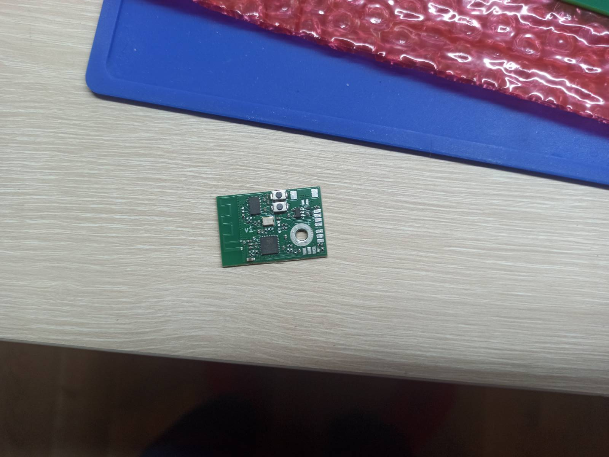
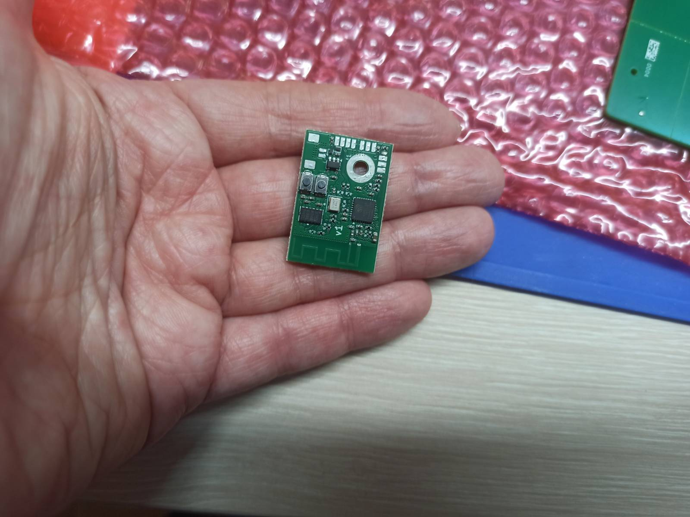
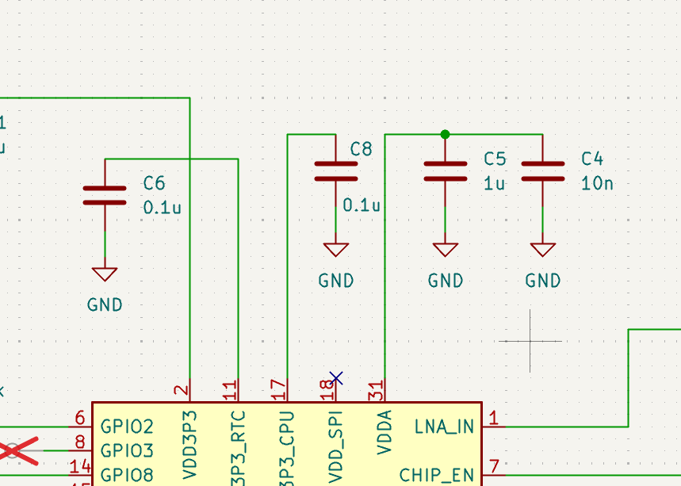

## Device Description

* The accelerometer board is based on the ESP32-C3FH4 microcontroller and the ADXL375 accelerometer.
* The device can be powered either from a battery or via USB. When USB is connected, the battery is automaticly disconnected over MOSFET.
* The USB port is connected using wires. It is used to power the device, flash firmware, and perform debugging.
* A spare UART port is available for firmware flashing and debugging.
* Several additional GPIOs are brought out to test points for possible future use.
* Communication is performed via Wi-Fi.
* Recording and transmission of data are intended to be carried out at different times (not simultaneously).

## Impact meter v1
There is few photos of ready device

## v1 known issues
3.3 V power supply do not connected to ESP32

